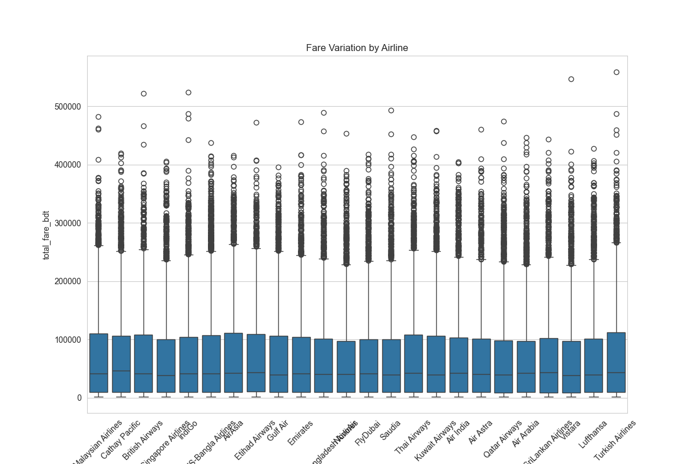
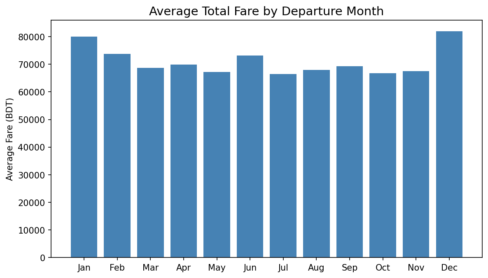
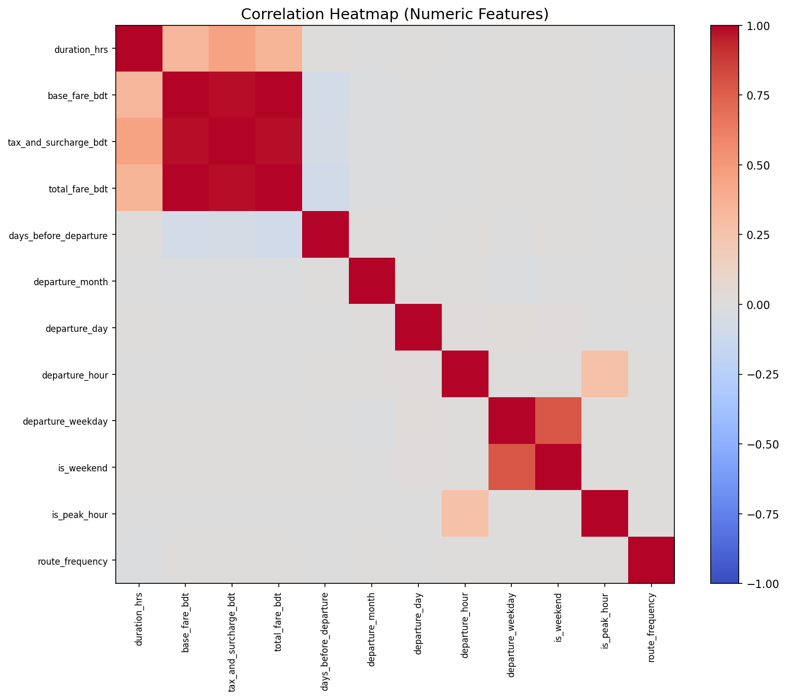
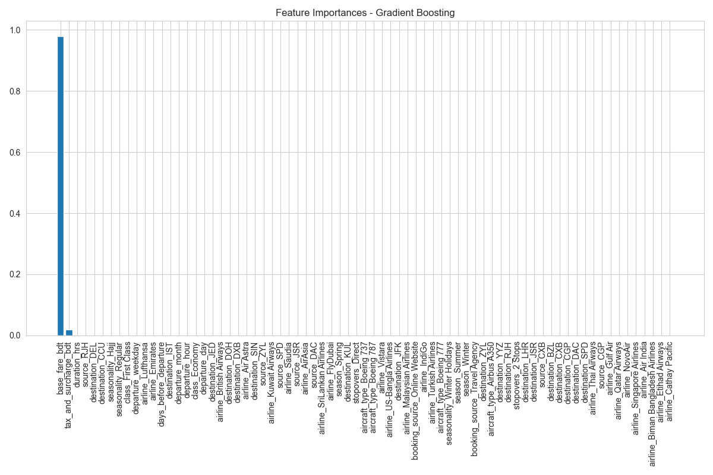

# Flight Fare Prediction

A comprehensive machine learning project for predicting flight fares using regression models. This end-to-end pipeline covers data preprocessing, exploratory data analysis, model training, evaluation, and deployment.

## Project Overview

### Business Problem
Airlines and travel platforms need to estimate ticket prices based on route, airline, travel date, and other factors to optimize pricing strategy and provide dynamic recommendations to customers.

### Machine Learning Task
- **Type**: Supervised Regression
- **Target Variable**: Total Fare (BDT)
- **Features**:
  - **Categorical**: Airline, Source, Destination, Stopovers, Aircraft Type, Class, Booking Source, Seasonality, Season
  - **Numerical**: Duration (hrs), Base Fare (BDT), Tax & Surcharge (BDT), Days Before Departure, Departure Month, Departure Day, Departure Hour, Departure Weekday

## Features

- **Data Pipeline**: Automated data loading, cleaning, and preprocessing
- **Exploratory Analysis**: Statistical analysis and visualizations of fare patterns
- **Multiple Models**: Linear Regression, Ridge, Lasso, Decision Tree, Random Forest, Gradient Boosting
- **Hyperparameter Tuning**: Grid search optimization for model performance
- **Model Evaluation**: Comprehensive metrics (R², MAE, RMSE) and comparisons
- **Feature Importance**: Analysis of key factors influencing fare prices
- **Modular Architecture**: Clean, maintainable code structure
- **Logging**: Detailed logging for monitoring and debugging

## Requirements

- Python 3.12+
- Dependencies listed in `requirements.txt`

## Installation

1. Clone the repository:
```bash
git clone https://github.com/manaf-dev/flight-fare-prediction.git
cd flight-fare-prediction
```

2. Create a virtual environment:
```bash
python -m venv venv
source venv/bin/activate  # On Windows: venv\Scripts\activate
```

3. Install dependencies:
```bash
pip install -r requirements.txt
```

## Dataset

The project uses the "Flight Price Dataset of Bangladesh" containing 57,000 flight records with 17 features:
- Airline, Source/Destination airports
- Departure/Arrival times and duration
- Aircraft type, class, booking source
- Base fare, taxes, and total fare
- Seasonality and days before departure

### Raw Dataset Inspection

**Dataset Shape:** (57,000, 17)

**Column Names (after cleaning):**
- airline, source, source_name, destination, destination_name, departure_date_and_time, arrival_date_and_time, duration_hrs, stopovers, aircraft_type, class, booking_source, base_fare_bdt, tax_and_surcharge_bdt, total_fare_bdt, seasonality, days_before_departure

**Dataset Statistics:**
- Total Fare Range: BDT 1,801 - 558,987 (Mean: BDT 71,030, Std: BDT 81,770)
- No missing values across all columns

**Data Types:**
- airline: object
- source: object
- source_name: object
- destination: object
- destination_name: object
- departure_date_and_time: object
- arrival_date_and_time: object
- duration_hrs: float64
- stopovers: object
- aircraft_type: object
- class: object
- booking_source: object
- base_fare_bdt: float64
- tax_and_surcharge_bdt: float64
- total_fare_bdt: float64
- seasonality: object
- days_before_departure: int64

### Processed Dataset for Training

After preprocessing, cleaning, and feature engineering, the dataset is transformed for model training:

**Processed Shape:** (57,000, 74)

**Engineered Features:**
- **Categorical (encoded via One-Hot):** airline, source, destination, stopovers, aircraft_type, class, booking_source, seasonality, season
- **Numerical (scaled via StandardScaler):** duration_hrs, base_fare_bdt, tax_and_surcharge_bdt, days_before_departure, departure_month, departure_day, departure_hour, departure_weekday

**Feature Engineering Details:**
- Date features extracted: departure_month, departure_day, departure_hour, departure_weekday
- Seasonal categorization: season (Spring, Summer, Autumn, Winter)
- One-hot encoding for categorical variables
- Standard scaling for numerical features
- Target variable: total_fare_bdt

## Usage

### ML Pipeline
Run the complete ML pipeline:
```bash
python pipeline/main.py
```

This will execute all steps from data loading to model training and save results to respective directories.

### Streamlit Web App
Launch the interactive flight fare prediction web application:
```bash
streamlit run app/app.py
```

The app will open in your browser at `http://localhost:8501` where you can:
- Input flight details (airline, route, dates, etc.)
- Get real-time fare predictions
- View insights and recommendations
- Explore model performance metrics

## Project Structure

```
flight_fare_prediction/
├── data/                          # Dataset directory
├── logs/                          # Log files
├── models/                        # Saved trained models
├── pipeline/                      # Main execution scripts
│   └── main.py                    # Pipeline orchestrator
├── reports/                       # Analysis reports
├── src/                           # Source code
│   ├── config.py                  # Configuration settings
│   ├── data_loader.py             # Data loading utilities
│   ├── data_preprocessing.py      # Data cleaning and feature engineering
│   ├── eda.py                     # Exploratory data analysis
│   ├── modeling.py                # Model training and evaluation
│   └── utils.py                   # Helper functions
├── visualizations/                # Generated plots and charts
├── requirements.txt               # Python dependencies
├── README.md                      # Project documentation
└── TODO.md                        # Development tasks
```

## Models

The pipeline trains and compares multiple regression models:

1. **Linear Regression** - Baseline model
2. **Ridge Regression** - L2 regularization
3. **Lasso Regression** - L1 regularization
4. **Decision Tree** - Tree-based model
5. **Random Forest** - Ensemble method
6. **Gradient Boosting** - Advanced ensemble

## Results

### Model Performance Comparison
```
                Model        R2          MAE         RMSE
0   Ridge Regression  0.996889  1703.189514  4553.767361
1   Lasso Regression  0.996889  1697.981275  4553.884739
2      Random Forest  0.999953    63.927418   557.927353
3  Gradient Boosting  0.999978   185.224515   381.357713
```

**Best Model**: Gradient Boosting (R² = 0.999979, MAE = 184.78 BDT)

### Key Insights

**Top Airlines by Average Fare (BDT):**
- Turkish Airlines: 75,547
- AirAsia: 74,534
- Cathay Pacific: 73,325
- Thai Airways: 72,846
- Malaysian Airlines: 72,775

**Seasonal Fare Variations:**
- Hajj: 97,144 BDT (highest)
- Eid: 91,560 BDT
- Winter Holidays: 79,677 BDT
- Regular: 68,077 BDT (lowest)

**Most Popular Routes:**
- Rajshahi (RJH) → Singapore (SIN): 417 flights
- Dhaka (DAC) → Dubai (DXB): 413 flights
- Barisal (BZL) → Toronto (YYZ): 410 flights

**Most Expensive Routes:**
- Saidpur (SPD) → Bangkok (BKK): 117,952 BDT
- Cox's Bazar (CXB) → Toronto (YYZ): 117,849 BDT
- Cox's Bazar (CXB) → London (LHR): 116,668 BDT

## Model Interpretation & Insights Report

For a comprehensive analysis of model interpretability, business insights, and strategic recommendations, refer to the detailed report:

**[Model Interpretation & Insights Report](reports/model_interpretation_and_insights.md)**

This report includes:
- **Feature Importance Analysis**: Detailed breakdown of Gradient Boosting feature importance and Ridge Regression coefficients
- **Business Insights**: Deep dive into fare drivers, airline pricing strategies, and seasonal/route variations
- **Stakeholder Recommendations**: Actionable insights for airlines, travel agencies, and passengers
- **Non-Technical Summary**: Clear communication of findings for business decision-makers

## Visualizations

The pipeline generates comprehensive visualizations saved to `visualizations/` directory:

### Generated Plots

1. **Fare Distribution**
   - Histogram showing the distribution of total fares
   - Helps understand the spread and skewness of fare prices
   

2. **Fare by Airline**
   - Boxplot comparing fare variations across different airlines
   - Identifies airlines with highest and lowest fare ranges
   

3. **Fare by Month**
   - Bar chart showing average fares by departure month
   - Reveals seasonal patterns in pricing
   

4. **Correlation Heatmap**
   - Heatmap showing correlations between numerical features
   - Identifies multicollinearity and feature relationships
   

5. **Actual vs Predicted (Baseline)**
   - Scatter plot comparing actual vs predicted fares for Linear Regression
   - Visual assessment of model fit and residuals
   

6. **Feature Importance**
   - Bar chart showing feature importance scores from Gradient Boosting model
   - Identifies the most influential features for fare prediction
   


